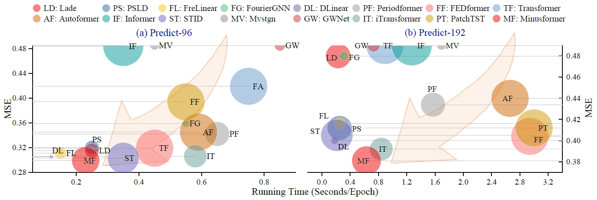
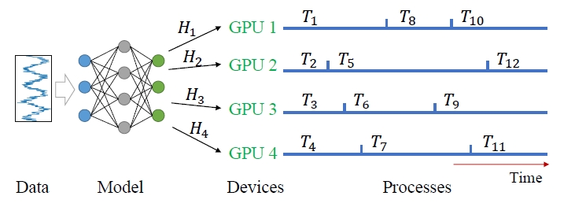
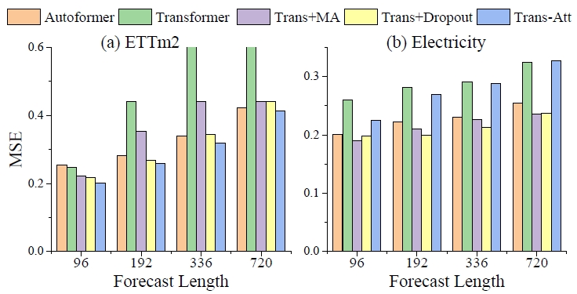
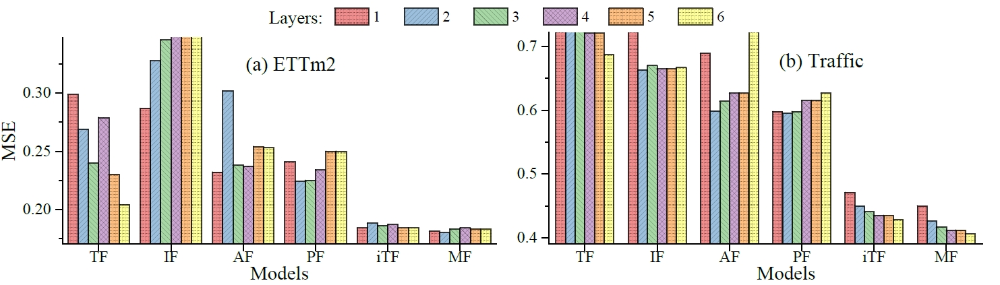
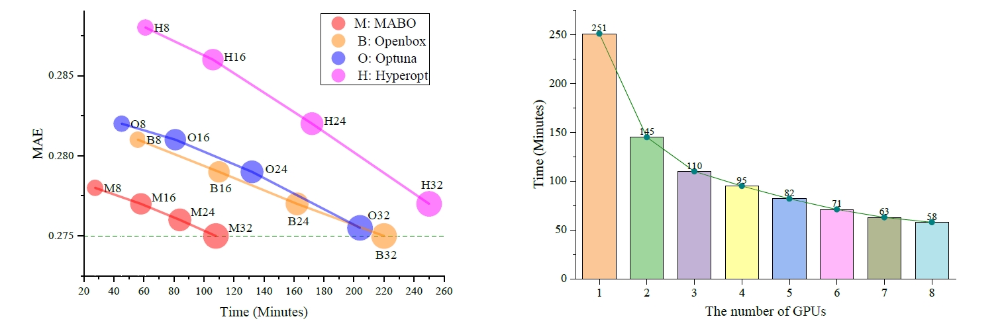
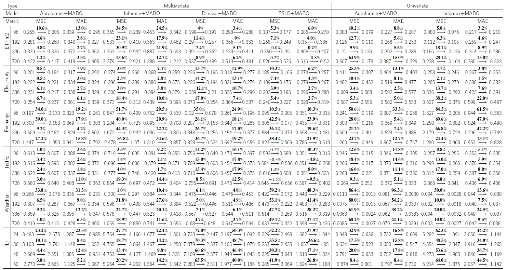

# MABO

**Revisiting Long-Term Series Forecasting: Efficient Hyperparameter Tuning Is What You Need**

<!--The repo is the official implementation for the paper: [MABO: Improving Time Series Forecasting by Progressively Learning Residuals](https://arxiv.org/abs/2402.02332).

Cited by [Awesome Time Series Forecasting/Prediction Papers](https://github.com/ddz16/TSFpaper); 
[English Blog](); [Zhihu](https://zhuanlan.zhihu.com/p/703948963); [CSDN Blog](https://blog.csdn.net/liangdaojun/article/details/139748253)-->

## 1. Introduction

Time Series Forecasting still faces two major problems that require further investigation: 1) Whether the sparse attention mechanism designed by these methods actually reduce the running time on real devices; 2) Whether these models need extra long input sequences to guarantee their performance?  
 - To take full advantage of GPUs for fast hyperparameter optimization (e.g., finding the suitable input length), a Multi-GPU Asynchronous parallel algorithm based on Bayesian Optimization (MABO) is presented.
 - MABO allocates a process to each GPU via a queue mechanism, then creates multiple trials at a time for asynchronous parallel search. The results are fused and improved by an expected improvement function, which greatly reduces the search time.
 - MABO gives 46% averaged search time reduction while guaranteeing the objective model achieves competitive performance, which shows that MABO can find better hyperparameters with a faster search speed. 
 - Importantly, this paper indicates that hyperparameters (e.g. short input lengths may also yield good performance) are interrelated and jointly impact the model's performance, and LTSF tasks may not need complex attention and extra long input sequences. 

<div align=center></div>

## 2. Contributions

 - It is found that although the computational complexity of those traditional Transformer-based LTSF methods is theoretically reduced, their running time on practical devices remains unchanged. Meanwhile, it is found that both the input length of the series and the kernel size of the MA have impacts on the final forecast.
 - A Multi-GPU Asynchronous parallel search algorithm based on Bayesian Optimization (MABO) is proposed. MABO allocates a single process to each GPU at a time for parallel search. Then, the search results are fused and improved by an expected improvement function, significantly accelerating the search speed.
 - Extensive experiments over six benchmark datasets across multiple domains are conducted to verify the performance of the proposed methods. MABO reduces the average search time by around **46%** while finding out better hyperparameters.

<div align=center></div>

## 3. Training and Testing MABO
### 1) Dataset 
The datasets can be obtained from [Google Drive](https://drive.google.com/file/d/1l51QsKvQPcqILT3DwfjCgx8Dsg2rpjot/view?usp=drive_link) or [Tsinghua Cloud](https://cloud.tsinghua.edu.cn/f/2ea5ca3d621e4e5ba36a/).

### 2) Clone the code repository
```git
git clone git@github.com:Anoise/MABO.git
```

### 3) Training on Time Series Dataset
Go to the directory "MABO/CommanTimeSeriesDatasets", we'll find that the bash scripts are all in the 'scripts' folder. Then, you can run the bash script like this:
```shell
    bash eval_async_mGPUs_AF.sh
```


## 4.  Ablation Studies on Input Length

Different input lengths have different impacts on the performance of the model on different datasets. For example, when the input length increases from 16 to 32 or 48 on ETTm2-M, the prediction error of different prediction lengths becomes larger. When the input length continues to increase, the prediction error returns to a lower level. Increasing the input length again until 144, the prediction error does not fluctuate significantly.

<div align=center></div>


## 5.  Ablation Studies on Layer Number

The number of layers has a great impact on some Transformer-based models.
For complex time series data, increasing the number of layers can increase the representation ability of the model, but it also increases the risk of overfitting.

<div align=center></div>

## 6. Performacne V.S. Time 

 MABO outperforms the other three methods in both predictive performance and search speed. 
Specifically, compared to Optuna, Openbox and Hyperopt, MABO brings **39%**, **51%**  and **55%** search time reduction when the number of trials is equal to 8,  Overall, MABO gives **46%** averaged search time reduction while achieving comparable performance, which verifies that MABO can make full use of the parallel advantages of multi-GPUs to significantly reduce the search time. 

<div align=center></div>


## 7. Performace on TS Forecasting

MABO achieves the consistent SOTA performance across all datasets and prediction length configurations.

<div align=center></div>

## 8. Citation

Citation will be coming soon!

